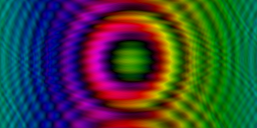

# Simulation of the Schrödinger-Poisson equation

[](https://travis-ci.org/afck/schroedinger)

An interactive visualization of the quantum wave function of a self-gravitating
particle described by the
[Schrödinger–Newton or Schrödinger–Poisson equation](https://en.wikipedia.org/wiki/Schr%C3%B6dinger%E2%80%93Newton_equation).
It shows the wave's phase at each point as the color hue and the amplitude as
the saturation, and lets you modify the wave function and potential with the
mouse.

(Note that this is just a toy; to be more than that it should be parallelized,
use the GPU, have a proper GUI, and be able to input and output the data from
and to files. Feel free to contribute!)




## Use

You can draw a static potential with the left mouse button and modify the wave
function with the right one.


The program is written in C++, using the [SDL](https://www.libsdl.org/) library,
and can be built using [CMake](http://www.cmake.org/) or
[SCons](http://www.scons.org/). E. g. on Ubuntu or Debian GNU/Linux, the
following should install the dependencies and download, build and run the
program:
```
sudo apt-get install libsdl2-dev scons git gcc libunittest++-dev
git clone https://github.com/afck/schroedinger.git
scons
./schr
```


## Contributing

If in doubt, let's use
```
clang-format -style=LLVM *.cc *.h -i
clang-tidy *.cc -header-filter='.*' -checks="readability-*,misc-*,llvm-include-order,google-readability-casting"
```
and otherwise loosely follow Geosoft's
[C++ Programming Style Guidelines](http://geosoft.no/development/cppstyle.html).
